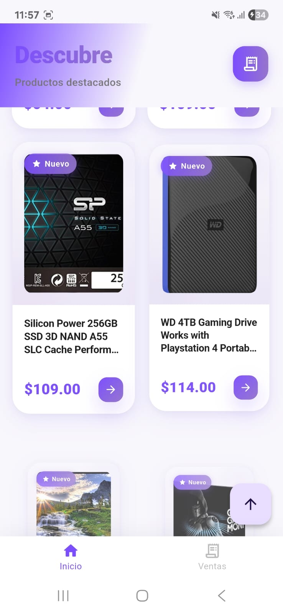
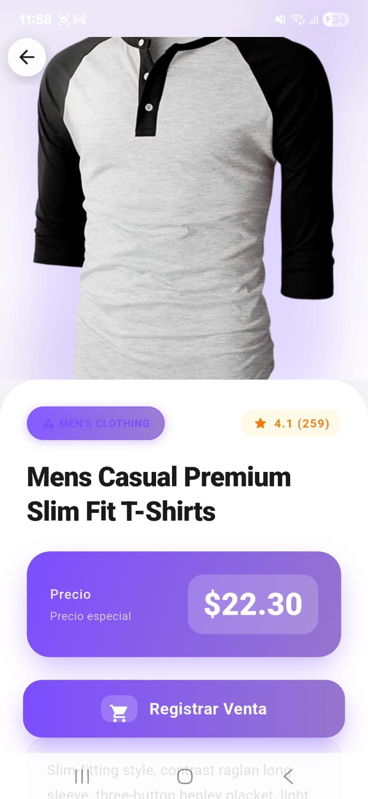
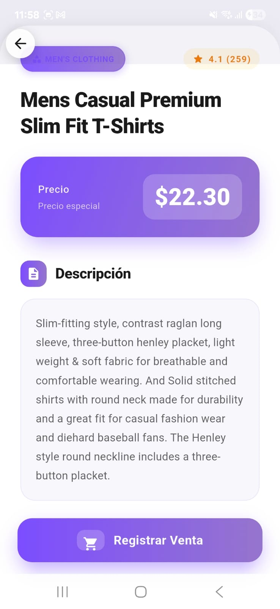
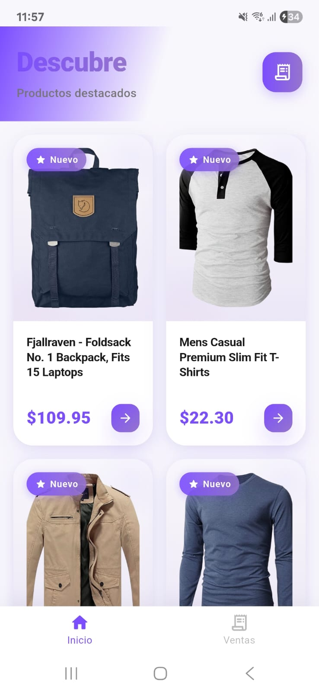
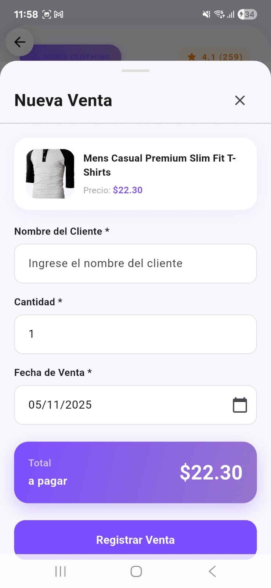
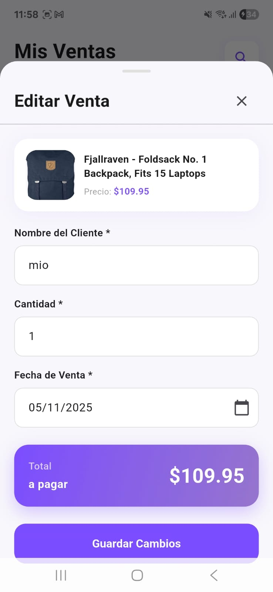
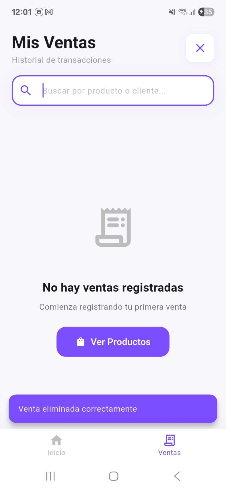

# Thomas App 🛍️

A modern Flutter application for managing products and sales with a clean architecture approach, implementing Domain-Driven Design (DDD), Screaming Architecture, and Atomic Design principles.


## 📱 Screenshots

<div align="center">
  
  
  
</div>

<div align="center">
  
  
  
</div>

<div align="center">
  
  
  
</div>

## 🏗️ Architecture

This project follows **Clean Architecture** principles with **Domain-Driven Design (DDD)**, **Screaming Architecture**, and **Atomic Design** for UI components.

### Screaming Architecture

The project structure "screams" its intent - when you look at the folder structure, you immediately understand that this is an application for managing **Products** and **Sales**. The architecture makes the business domain obvious at first glance, not the frameworks or tools being used.

```
features/
├── products/    ← Screams "This app handles Products!"
└── sales/       ← Screams "This app handles Sales!"
```

This approach, advocated by Uncle Bob (Robert C. Martin), ensures that:

- **Business domain is front and center**: The folder structure reveals the application's purpose
- **Framework independence**: Flutter/Riverpod are implementation details, not the focus
- **Use case driven**: Features are organized by what the application does, not by technical layers
- **Immediate understanding**: New developers can understand the business domain instantly

### Project Structure

```
lib/
├── core/                          # Core utilities and constants
│   ├── constants/
│   │   └── api_constants.dart    # API configuration
│   └── utils/
│       └── formatters.dart       # Date and currency formatters
│
├── features/                      # Feature modules (DDD)
│   ├── products/                 # Products feature
│   │   ├── domain/              # Business logic layer
│   │   │   ├── entities/        # Pure business objects
│   │   │   │   ├── product.dart
│   │   │   │   └── rating.dart
│   │   │   ├── repositories/    # Abstract contracts
│   │   │   │   └── product_repository.dart
│   │   │   └── usecases/        # Business rules
│   │   │       └── get_products.dart
│   │   ├── data/                # Data access layer
│   │   │   ├── models/          # Data transfer objects
│   │   │   │   ├── product_model.dart
│   │   │   │   └── rating_model.dart
│   │   │   ├── repositories/    # Repository implementations
│   │   │   │   └── product_repository_impl.dart
│   │   │   └── datasources/     # External data sources
│   │   │       └── product_remote_datasource.dart
│   │   └── presentation/        # UI layer
│   │       ├── pages/
│   │       │   ├── products_page.dart
│   │       │   └── product_detail_page.dart
│   │       ├── widgets/         # Feature-specific widgets
│   │       │   ├── product_card.dart
│   │       │   └── product_loading_shimmer.dart
│   │       └── providers/       # State management
│   │           └── products_provider.dart
│   │
│   └── sales/                    # Sales feature (similar structure)
│       ├── domain/
│       ├── data/
│       └── presentation/
│
└── shared/                       # Shared components (Atomic Design)
    ├── presentation/
    │   ├── theme/               # Centralized theme
    │   │   ├── app_colors.dart
    │   │   └── app_shadows.dart
    │   └── widgets/
    │       ├── atoms/           # Basic building blocks
    │       │   ├── app_badge.dart
    │       │   ├── decorative_circle.dart
    │       │   ├── gradient_button.dart
    │       │   ├── gradient_container.dart
    │       │   ├── icon_button_atom.dart
    │       │   └── price_text.dart
    │       ├── molecules/       # Simple component combinations
    │       │   ├── custom_app_bar.dart
    │       │   └── empty_state.dart
    │       ├── organisms/       # Complex components
    │       │   ├── sale_bottom_sheet.dart
    │       │   └── delete_sale_bottom_sheet.dart
    │       └── templates/       # Page layouts
    │           └── base_page_template.dart
    └── infrastructure/
        └── database/
            └── database_helper.dart  # SQLite management
```

## 🎯 Key Features

### Products Module

- ✅ **Product Listing**: Grid view with beautiful gradient cards
- ✅ **Product Details**: Detailed view with ratings, categories, and descriptions
- ✅ **Real-time Data**: Fetches products from FakeStore API
- ✅ **Rating System**: Displays product ratings with star icons and review counts
- ✅ **Category Badges**: Visual category indicators with icons
- ✅ **Smooth Animations**: Animated scrolling and transitions

### Sales Module

- ✅ **CRUD Operations**: Create, Read, Update, Delete sales
- ✅ **Local Storage**: SQLite database for offline-first approach
- ✅ **Search & Filter**: Search by product title and client name
- ✅ **Bottom Sheets**: Modern modal sheets for forms and confirmations
- ✅ **Form Validation**: Date pickers and input validation
- ✅ **Empty States**: Friendly messages when no data exists
- ✅ **Total Calculations**: Automatic total price calculation (quantity × unit price)

### UI/UX Features

- ✅ **Modern Purple Theme**: Consistent color scheme with gradients
- ✅ **Responsive Design**: Adapts to different screen sizes
- ✅ **Android System UI**: Proper status bar and navigation bar configuration
- ✅ **Dynamic Padding**: Handles keyboard and navigation bar overlaps
- ✅ **Loading States**: Shimmer effects and progress indicators
- ✅ **Error Handling**: User-friendly error messages
- ✅ **Smooth Scrolling**: Physics-based animations

## 🧩 Architecture Patterns

### 1. Screaming Architecture

The project structure immediately reveals its business purpose:

```
lib/
├── features/           ← Business domains are obvious
│   ├── products/      ← "We manage products!"
│   └── sales/         ← "We manage sales!"
├── core/              ← Supporting utilities
└── shared/            ← Reusable components
```

**Key Principles:**

- **Intent over Implementation**: Folder names describe what the app does, not how it's built
- **Business First**: Domain concepts are more visible than technical frameworks
- **Self-Documenting**: The structure tells a story about the business domain
- **Developer-Friendly**: New team members understand the domain immediately

### 2. Domain-Driven Design (DDD)

The project is organized by business domains (Products, Sales) with clear layer separation:

```
Domain Layer (Business Logic)
    ↓
Data Layer (Data Access)
    ↓
Presentation Layer (UI)
```

**Benefits:**

- Clear separation of concerns
- Business logic independent of frameworks
- Easy to test and maintain
- Scalable architecture

### 3. Atomic Design

UI components follow the Atomic Design methodology:

```
Atoms (Basic elements)
    ↓
Molecules (Simple combinations)
    ↓
Organisms (Complex components)
    ↓
Templates (Page layouts)
    ↓
Pages (Final implementations)
```

**Benefits:**

- Reusable components
- Consistent design system
- Easy to maintain and scale
- Clear component hierarchy

### 4. Repository Pattern

Abstract data access through repository interfaces:

```dart
// Domain layer defines the contract
abstract class ProductRepository {
  Future<List<Product>> getProducts();
}

// Data layer implements it
class ProductRepositoryImpl implements ProductRepository {
  final ProductRemoteDatasource datasource;

  @override
  Future<List<Product>> getProducts() async {
    // Implementation details
  }
}
```

### 5. Use Cases (Single Responsibility)

Each use case encapsulates one business operation:

```dart
class GetProducts {
  final ProductRepository repository;

  Future<List<Product>> call() {
    return repository.getProducts();
  }
}
```

## 🎨 Design System

### Theme Colors

```dart
// Primary Purple Palette
primaryPurple: Color(0xFF7C4DFF)      // Main brand color
lightPurple: Color(0xFF9575FF)        // Lighter variant
darkPurple: Color(0xFF5E35B1)         // Darker variant
backgroundLight: Color(0xFFF5F5F5)    // Light background
white: Color(0xFFFFFFFF)              // Pure white
```

### Atomic Components

#### Atoms

- **GradientButton**: Reusable button with gradient background
- **AppBadge**: Category, rating, and featured badges
- **PriceText**: Formatted price display
- **IconButtonAtom**: Consistent icon buttons
- **DecorativeCircle**: Background decoration elements

#### Molecules

- **CustomAppBar**: Application bar with navigation
- **EmptyState**: User-friendly empty state messages

#### Organisms

- **SaleBottomSheet**: Form for creating/editing sales
- **DeleteSaleBottomSheet**: Confirmation dialog for deletions

## 🧪 Testing

The project includes comprehensive test coverage with **45 passing tests**:

```bash
flutter test
```

### Test Structure

```
test/
├── features/
│   ├── products/
│   │   ├── domain/entities/
│   │   │   └── product_test.dart          # Entity tests
│   │   └── data/models/
│   │       └── product_model_test.dart    # Model serialization tests
│   └── sales/
│       ├── domain/entities/
│       │   └── sale_test.dart
│       └── data/models/
│           └── sale_model_test.dart
├── core/utils/
│   └── formatters_test.dart               # Utility tests
└── shared/presentation/widgets/atoms/
    ├── price_text_test.dart               # Widget tests
    ├── gradient_button_test.dart
    └── app_badge_test.dart
```

**Test Coverage:**

- ✅ Domain Entities: Property validation and business logic
- ✅ Data Models: JSON serialization/deserialization
- ✅ Utils: Date and currency formatting
- ✅ Widgets: Rendering, interactions, and edge cases

## 🛠️ Tech Stack

### Core

- **Flutter 3.37.0-beta**: Latest beta version with cutting-edge features
- **Dart 3.10.0-beta**: Modern Dart features with null safety

### State Management

- **Riverpod 3.0.3**: Code generation and type-safe state management
- **flutter_riverpod 3.0.3**: Flutter integration
- **riverpod_annotation 3.0.3**: Annotations for code generation

### Networking

- **Dio 5.9.0**: Powerful HTTP client for API calls

### Local Storage

- **sqflite 2.4.2**: SQLite database for local data
- **sqflite_common_ffi 2.3.6**: FFI implementation for desktop
- **path 1.9.1**: File system path manipulation

### Navigation

- **go_router 16.3.0**: Declarative routing with deep linking support

### Code Generation

- **riverpod_generator 3.0.3**: Provider code generation
- **build_runner 2.10.1**: Build tool for code generation
- **riverpod_lint 3.0.3**: Linting rules for Riverpod best practices

### Development

- **flutter_lints 6.0.0**: Recommended lints for Flutter
- **cupertino_icons 1.0.8**: iOS style icons

## 📦 Getting Started

### Prerequisites

- Flutter SDK 3.37.0-beta or higher
- Dart SDK 3.10.0-beta or higher
- Android Studio / VS Code
- Android SDK / Xcode (for mobile development)

### Installation

1. **Clone the repository**

   ```bash
   git clone https://github.com/HamelBarrer/thomas_app.git
   cd thomas_app
   ```

2. **Install dependencies**

   ```bash
   flutter pub get
   ```

3. **Generate code (for Riverpod providers)**

   ```bash
   dart run build_runner build --delete-conflicting-outputs
   ```

4. **Run the app**

   ```bash
   flutter run
   ```

5. **Run tests**
   ```bash
   flutter test
   ```

### Build for Production

```bash
# Android
flutter build apk --release
flutter build appbundle --release

# iOS
flutter build ios --release

# Web
flutter build web --release
```

## 📚 API Integration

The app uses [FakeStore API](https://fakestoreapi.com/) for product data:

- **Base URL**: `https://fakestoreapi.com`
- **Endpoint**: `/products`
- **Method**: GET
- **Response**: List of products with ratings

Example response:

```json
{
  "id": 1,
  "title": "Product Name",
  "price": 109.95,
  "description": "Product description...",
  "category": "electronics",
  "image": "https://...",
  "rating": {
    "rate": 4.5,
    "count": 120
  }
}
```

## 🗄️ Database Schema

### Sales Table

```sql
CREATE TABLE sales (
  id INTEGER PRIMARY KEY AUTOINCREMENT,
  client_name TEXT NOT NULL,
  product_id INTEGER NOT NULL,
  product_title TEXT NOT NULL,
  product_image TEXT NOT NULL,
  quantity INTEGER NOT NULL,
  unit_price REAL NOT NULL,
  total_price REAL NOT NULL,
  sale_date TEXT NOT NULL
);
```

## 🎯 Future Enhancements

- [ ] User authentication and authorization
- [ ] Multiple themes (dark mode)
- [ ] Sales analytics and charts
- [ ] Export sales to PDF/Excel
- [ ] Product inventory management
- [ ] Multi-language support (i18n)
- [ ] Cloud synchronization
- [ ] Push notifications
- [ ] Barcode scanner integration

## 🤝 Contributing

Contributions are welcome! Please feel free to submit a Pull Request.

1. Fork the repository
2. Create your feature branch (`git checkout -b feature/AmazingFeature`)
3. Commit your changes (`git commit -m 'Add some AmazingFeature'`)
4. Push to the branch (`git push origin feature/AmazingFeature`)
5. Open a Pull Request

## 📝 Code Quality

The project follows:

- ✅ **Clean Code** principles
- ✅ **SOLID** principles
- ✅ **DRY** (Don't Repeat Yourself)
- ✅ **Screaming Architecture** (intent-revealing structure)
- ✅ **Domain-Driven Design** (DDD)
- ✅ **Atomic Design** for UI components
- ✅ **Proper error handling**
- ✅ **Comprehensive testing**
- ✅ **Clear documentation**

## ⏱️ Project Timeline

This project was developed efficiently with a focus on clean architecture:

### Development Phases

| Phase                     | Description                                                                      | Duration  |
| ------------------------- | -------------------------------------------------------------------------------- | --------- |
| 🏗️ **Architecture Setup** | Initial project structure with DDD, Screaming Architecture, and layer separation | 30 min    |
| 🎨 **Design System**      | Atomic Design implementation, theme system, and reusable components              | 1 hour    |
| 📦 **Products Module**    | API integration, product listing, detail pages, and state management             | 1 hour    |
| 💰 **Sales Module**       | Complete CRUD operations, SQLite database, search & filtering                    | 1.5 hours |
| 🎯 **UI/UX Polish**       | Animations, gradients, bottom sheets, Android system UI configuration            | 1 hour    |
| 🧪 **Testing**            | Comprehensive test suite with 45 unit and widget tests                           | 1 hour    |
| 📝 **Documentation**      | Complete README with architecture explanations and screenshots                   | 30 min    |

### Total Development Time

**Approximately 6-7 hours** of focused development, testing, and documentation.

### Key Achievements

- ✅ Clean, maintainable, and scalable architecture
- ✅ Comprehensive testing (45 tests passing)
- ✅ Production-ready code with proper error handling
- ✅ Complete documentation for easy onboarding

## 📄 License

This project is licensed under the MIT License - see the LICENSE file for details.

## 👨‍💻 Author

**Hamel Barrer**

- GitHub: [@HamelBarrer](https://github.com/HamelBarrer)

## 🙏 Acknowledgments

- [FakeStore API](https://fakestoreapi.com/) for providing the product data
- Flutter community for excellent packages and resources
- Atomic Design methodology by Brad Frost
- Clean Architecture principles by Robert C. Martin (Uncle Bob)
